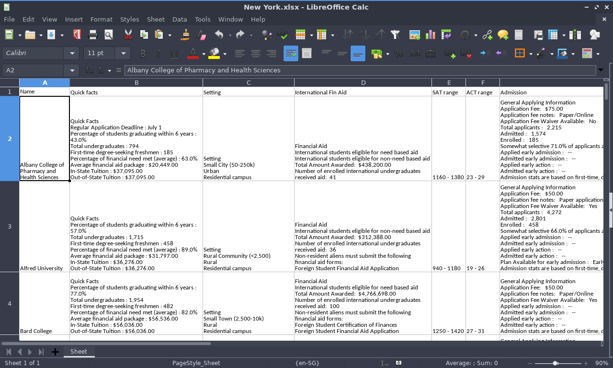

# BigFuture Web scaper
An automated Python web scraper to mass collect college data from CollegeBoard's BigFuture database to aid high school students around the world in their US college search process.

## Motivation
---
[CollegeBoard's BigFuture](https://bigfuture.collegeboard.org/) has long been a reliable source for US college information, but the site lacks the ability to easily compare multiple schools, and information is not displayed very comprehensively on a single view. Therefore, I created this tool to automatically scrape all your desired colleges/universities' info and display all relevant data in an Excel sheet for easy comparision and manipulation.

## Features
---
* Takes ony 4 seconds to collect data on a school, and 6 minutes for 100 schools, 7 times faster than manual copy and paste.
* Collected fields include: Name, Address, School setting, Quick facts, International financial aid, SAT range, ACT range, Admission information, Deadlines, and Costs.
* Output in CSV format and XLSX format for easy data comparision and manipulation.
* Popular school list and each state's school list are already generated for you



## Usage
---
A popular school list consisting of top 125 colleges has been generated beforehand, in the `popular_schools.xlsx` file. A comprehensive lists of all universities within each US state is also ready, located in each `states/[state_name]` folder.

### Running the scraper with custom school list:
You can also run the scraper script with a custom school list of your choice:
1. Have [Python 3](https://www.python.org/downloads/) installed on your system, and use pip to install the required packages by running `python3 -m pip install -r requirements.txt`
2. Make changes to the `custom_names.txt` file by adding the names of your desired schools. (There are some rules about naming that you must follow. See the [Special note on college's naming](#Speicla-note-on-colleges-naming) section below)
3. Run the `scraper.py` file in your terminal/command prompt:
```bash
python3 scraper.py
```
4. A `custom_schools.csv` and `custom_schools.xlsx` will be created and you can view your data in the XLSX file.

Note: Reruns of the script will overwrite existing data in `custom_schools.csv` and `custom_schools.xlsx` with the new data. Therefore, if you want to keep previously generated data in these two files, you can rename them a different name after a run, ensuring subsequent run will not have a name clash and will not overwrite.

## How it workds
---
1. School names list is first read from the appropriate .txt file
2. For each school, "[https://bigfuture.collegeboard.org/college-university-search/[school_name]](https://bigfuture.collegeboard.org/college-university-search/university-of-cincinnati)" is accessed. 
3. **BeautifulSoup4** with lxml parser along with **Regular Expressions** are then used to read the page source and find the hidden ID code of the school. Note that it is not possible to quickly scrape data on this page because page content is dynamically generated.
4. With the ID code, the [https://bigfuture.collegeboard.org/college-university-search/print-college-profile?id=[ID_code]](https://bigfuture.collegeboard.org/college-university-search/print-college-profile?id=4035) static site is accessed and data will be scraped quickly using **html5lib** and its element tree's XPATH utility.
5. Data is finally collected and outputed in a CSV format, and then converted to XLSX format.

## Special note on college's naming
---
Because this is only a web scraper tool taking data from BigFuture database, input colleges' names must match the name registed in BigFuture's URL system for the scraper to work. The following rules will help you have better success rate when using the tool:

1. **USE FULL NAME** when inputing colleges' names. For example: Use "University of California at Berkley" instead of "UC Berkeley".

2. College's name should not contain special symbols like: **'(s)** (possive s), **.** (dot), **&**, or **-**. For example: Use **_St Josephs College_** instead of "St. Josephs College", **_Saint Marys College of California_** instead of "Saint Mary's College of California", **_Texas AM University_** instead of "Texas A&M University"

3. Multiple colleges with duplicated names will need an ID code after the college's name to differentiate. For example: **Wheaton College** in _Massachusetts_ is registered under name **_Wheaton College 4115_** whereas **Wheaton College** in _Illinois_ is registered under name **_Wheaton College 1353_**. To know the appropriate ID code, you can use the school's state information and refer to the provided school list text file in the `states/[state_name]` folder.

If you are unable to find correct naming for the college on your own, you can Google the address of your desired school and then consult the specific name list associated with the state in the `states/[state_name]/[state_name].txt` file to find the correct naming of the college/university.

Unmatched school names will produce an `Incorrect school name for [school_name]` alert message in the terminal when running the tool.

An example with school naming conventions has been provided for you in the `custom_names.txt` file.

## Example run
In `custom_names.txt`:
```text
City University of New York York College
St Josephs College
SUNY College of Technology at Canton
Ohio State University Columbus Campus
Wheaton College 4115
Skidmore Colleg
```
In terminal/command prompt:

```bash
$ python3 scraper.py
1.City University of New York York College, id = 3180
2.St Josephs College, id = 1508
3.SUNY College of Technology at Canton, id = 2891
4.Ohio State University Columbus Campus, id = 2007
5.Wheaton College 4115, id = 4115
6.Incorrect school name 'Skidmore Colleg'
Incorrect school name 'Skidmore Colleg'. Line 6
```
